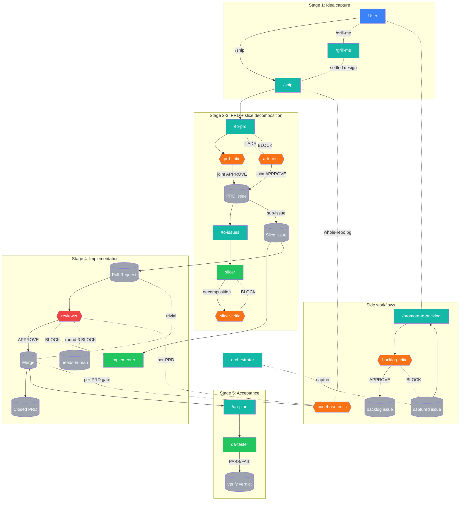

<!-- AUTO-GENERATED from README.template.md — edit the template, run the generator. -->
# project-claude

A clone-as-template starter for AI-coded projects, replicating the workflow of a **senior engineer overseeing a small team of developers** — but with AI agents instead of humans. Built on 20-year-old software engineering practices (small slices, fast feedback, git-tracked changes, PR review, scope discipline) and heavy borrowing from [Matt Pocock's skills repo](https://github.com/mattpocock/skills).

> **New here? Start here →** Jump to the [5-Minute Quickstart](#5-minute-quickstart) for a literal first-use cycle. Skim the [Concepts cheat sheet](#concepts-cheat-sheet) for one-line definitions. Hit the [FAQ](#frequently-asked-questions) for common newcomer questions. For deep theory, scroll to *What's the idea*; for the architecture, see [CLAUDE.md](CLAUDE.md).

## Using this repo as a template

This repo is designed to be cloned under your own owner/name and run as-is — no find-and-replace needed. All repo identity (GraphQL queries, PR links, escalation mentions) is derived at runtime from `git remote` and `gh`.

**One-time setup checklist:**

1. **Clone** under your own owner and repo name:
   ```bash
   git clone https://github.com/<your-owner>/<your-repo> my-project
   cd my-project
   ```
2. **Authenticate** with the GitHub CLI:
   ```bash
   gh auth login
   ```
3. **Run bootstrap** — creates all required labels (including `needs-human-check`), installs git hooks via `core.hooksPath`, checks that `gh`, `git`, and `python3` are on your PATH, creates the configured integration branch from the release branch's tip if your clone doesn't already have one, and applies branch protection R1+R2+R4 to both configured branches (per [ADR-0089](decisions/0089-per-repo-pipeline-identity.md) D1/D2 — this repo's configured pair is `develop`/`main`; a fresh template clone gets `develop`/`main` too unless you edit `.claude/pipeline.conf`):
   ```bash
   bash bootstrap.sh
   ```
4. **Optionally create a project board** — `bootstrap.sh` detects an existing GitHub Project v2 board named "project-claude"; create one via `gh project create --title "project-claude"` if you want the Backlog/Captured columns. The pipeline works without it, but the board gives you a visual queue.
5. **Open in Claude Code** — `CLAUDE.md` auto-loads; the agents are oriented. Start with `/grill-me` for your first feature.

**Runtime identity — nothing to configure.** `dashboard/collector.py` resolves the repo slug via `gh repo view --json nameWithOwner` (with a `git remote get-url origin` parse fallback). Every API payload, PR link, and escalation mention derives from that single source at runtime. For unusual multi-remote or CI setups, set the `DASH_REPO_SLUG` environment variable (e.g. `DASH_REPO_SLUG=my-org/my-repo`) to override resolution.

**Assumption:** a single `origin` remote pointing to github.com. SSH and HTTPS origins both parse correctly; GitHub Enterprise is not supported.

## What's the idea

You play **senior engineer**. AI agents play **the team**. The template ships an autonomous pipeline with **exactly two human-touch points**:

- **Start — `/grill-me`** — the agent interviews you about the idea until both of you share the same picture of what's being built.
- **End — `/qa-plan`** — after every slice of the PRD has merged, the agent produces a human-runnable acceptance checklist. You verify; you sign off.

Everything in between — PRD authoring, slice decomposition, implementation, review, merge — is autonomous, gated by adversarial AI critics rather than per-stage human approval.

The middle is glued together by one command: **`/ship`**. After `/grill-me`, you invoke `/ship` and the pipeline chains `to-prd → prd-critic → slicer → slicer-critic → implementer → reviewer → merge` per slice until the PRD is done. Stage 4 (implementation) is autonomous via the [`implementer`](.claude/agents/implementer.md) subagent — `/ship` auto-invokes it on each posted slice with DAG-aware parallel batching, no manual implementation trigger needed (per [ADR-0010](decisions/0010-implementer-subagent-auto-pipeline.md)). See [ADR-0003](decisions/0003-autonomous-pipeline-with-critics.md) D2 for the 5-stage pipeline and [ADR-0003](decisions/0003-autonomous-pipeline-with-critics.md) D4 for why there are no human gates in the middle.

**QA stage (Tier 1, ADR-0020 — runnable end-to-end via `/qa-plan`).** The terminal `/qa-plan` checkpoint is a writer/executor split: the writer (skill, main-agent context) LLM-extracts each PRD §2 acceptance criterion into a mechanical bash check or a `JUDGMENT` flag, persists the plan as a PRD comment for audit + re-runnability, then dispatches the [`qa-tester`](.claude/agents/qa-tester.md) generator subagent (tools: Read/Bash/Grep only) to execute the plan and return a per-criterion verdict table. Judgment rows and EXTRACT_FAILED rows are surfaced to you via `AskUserQuestion`; on all-PASS + all-judgment-ACCEPT the PRD auto-closes. Shipped through the autonomous pipeline as the QA writer/executor split per [ADR-0020](decisions/0020-qa-automation-writer-executor.md). Per [ADR-0020](decisions/0020-qa-automation-writer-executor.md) D9 + [ADR-0046](decisions/0046-codebase-critic-and-parsimony-reframe.md) D1 the critic-parsimony principle is honored — qa-tester is the 3rd generator (alongside `slicer` and `implementer`), not a critic.

**Forward queue.** Future-PRD ideas live as `backlog`-labeled GitHub Issues + a "Backlog" column on the project board (per [ADR-0006](decisions/0006-backlog-and-session-continuity.md)). Browse with `gh issue list --label backlog`. Promotion to a PRD: `gh issue edit <N> --remove-label backlog --add-label prd` + `/grill-me #<N>`.

**Captured → backlog autopilot.** Per [ADR-0008](decisions/0008-workflow-autolog-bootstrap-and-naming.md), any agent that surfaces a deferred-work idea writes it as a `captured`-labeled issue and invokes the [`/promote-to-backlog`](.claude/skills/promote-to-backlog/SKILL.md) skill inline. The [`backlog-critic`](.claude/agents/backlog-critic.md) subagent gates the promotion against a 4-criterion rubric (actionable / scoped / not duplicate / clear); on APPROVE the autopilot swaps labels `captured` → `backlog`, on BLOCK the item stays in the captured tier as a graveyard for lazy human review (default-conservative per [ADR-0008](decisions/0008-workflow-autolog-bootstrap-and-naming.md) D4).

**Why two tiers?** `captured` is a low-bar safety net — agents capture deferred work indiscriminately (CLAUDE.md rule #11) so nothing gets lost; the autopilot's `backlog-critic` filters them down to the curated `backlog` queue you actually pick PRDs from. BLOCKed captures stay in the captured-tier graveyard for lazy human review — three options per item: cull (close), rescue (manually relabel `captured` → `backlog`), or restructure-and-recapture.

**Session continuity.** New Claude Code sessions reconstruct state from live state (`git log`, `gh issue list`, `gh pr list`, project board) — no formal handoff document. See the "Session continuity" section in [CLAUDE.md](CLAUDE.md) for the canonical procedure.

## 5-Minute Quickstart

A literal walkthrough of the first full feature cycle. Pick something tiny — e.g., a `/say-hello` skill that prints a greeting. (Real PRDs are bigger; we use `/say-hello` here purely to make the example fit in 5 minutes.)

**1. Clone + bootstrap (one-time, ~30 seconds):**

```bash
git clone https://github.com/<your-owner>/<your-repo> my-new-project
cd my-new-project
./bootstrap.sh         # creates labels, installs git hooks, applies branch protection
```

**2. Open the repo in Claude Code.** `CLAUDE.md` auto-loads; the agents are oriented.

**3. Grill the idea (~2 minutes).** Run `/grill-me I want a /say-hello skill that prints a friendly greeting`. The agent interviews you one question at a time:

```
Agent:  1. Should /say-hello take an optional name argument, or always greet "world"?
        Recommendation: 1B (optional argument) — slightly more useful, same LoC.
        1A. always "Hello, world!"     pros: dead simple; cons: not personalizable
        1B. optional name argument     pros: useful; cons: trivially more code
        1C. read name from git config  pros: zero-arg + personal; cons: edge cases
You:    1B
Agent:  2. Should output go to stdout, or use AskUserQuestion?
        ...
```

After 3-5 questions the agent confirms the settled design and returns.

**4. Ship it (autonomous, ~2 minutes wall-clock for a trivial example).** Run `/ship`. The orchestrator chains: `to-prd` → `prd-critic` (≤3 APPROVE/BLOCK rounds) → `slicer` → `slicer-critic` → posts the PRD + slice issues → `implementer` writes the code per slice → `reviewer` audits the PR → auto-merges on APPROVE. You watch; you don't touch.

**5. Verify (~30 seconds).** When the last slice merges, run `/qa-plan <PRD-number>`. The `qa-tester` subagent walks each acceptance criterion mechanically; subjective ones surface via `AskUserQuestion`. On all-PASS the PRD auto-closes.

That's the full loop. Two human commands (`/grill-me`, `/qa-plan`), one orchestration command (`/ship`), and the rest is autonomous.

## Concepts cheat sheet

One-line definitions of the load-bearing terms. For the full canonical glossary (with authority citations), see [CLAUDE.md `## Glossary`](CLAUDE.md#glossary).

- **PRD** — feature-sized GitHub issue (label `prd`); top of the PRD → Slice → PR hierarchy.
- **slice** — INVEST-shaped sub-issue of a PRD (label `slice`); one PR; ≤600 LoC diff.
- **skill** — user-invocable command at `.claude/skills/<name>/SKILL.md` (e.g., `/ship`).
- **subagent** — specialist at `.claude/agents/<name>.md` with isolated context + restricted tools.
- **critic** — adversarial subagent judging a stage's output with APPROVE/BLOCK (≤3 rounds).
- **generator** — subagent producing output (decompositions, code, test plans); paired with a critic.
- **autopilot** — inline-firing mechanism (e.g., `/promote-to-backlog` after a captured-label issue).
- **trivial-lane** — fast path (I3) for PRs ≤10 LoC; branch `hotfix/<N>-...`, label `trivial`.

## Frequently asked questions

### Do I have to use `/grill-me`?

Recommended for any new feature. Skippable for the trivial lane (I3 — PRs ≤10 LoC, no behavior change, branch `hotfix/<N>-...`). The `/to-prd` skill also accepts a clear pre-written spec if you'd rather draft offline. The autopilot enforces no hard requirement today, though a future PRD may make `/grill-me` mechanically required for new features.

### Why is Claude asking permission to edit every file?

The `PreToolUse(Edit|MultiEdit|Write)` hook ([ADR-0023](decisions/0023-validation-and-notification-hooks-extension.md) D3) emits `permissionDecision: "ask"` when the **main agent** (not a subagent) writes a tracked file. This is the mechanical enforcement of CLAUDE.md rule #10 — main-agent meta-output discipline. Subagent edits (e.g., `implementer` shipping a slice) skip the prompt entirely. If you see prompts on every edit including untracked / gitignored files, you may be hitting captured issue #222 — make sure `jq` is installed and on your PATH.

### What if I want to skip critics?

You can't via the pipeline. The joint-APPROVE gate ([ADR-0004](decisions/0004-bypass-prevention.md) D1) is non-negotiable, and `reviewer` is the sole gate per PR ([ADR-0002](decisions/0002-autonomous-merge-policy.md)). You CAN, however, escalate a round-3 BLOCK to a `needs-human` label and apply your own judgment in a manual PR — that's the designed escape valve.

### How do I add a new subagent?

Author `.claude/agents/<name>.md` per [ADR-0001](decisions/0001-foundational-design.md) D6; declare tool boundaries in the frontmatter; write the body per ADR-0001 D6 and the embedded standards in the subagent's own file (the quality rubric is inlined directly in each subagent's body). If your new subagent is a critic, honor the critic-parsimony principle ([ADR-0046](decisions/0046-codebase-critic-and-parsimony-reframe.md) D1) — minimize critics; each must earn its place against a distinct concern; a new ADR must justify why an existing critic's rubric can't absorb the concern.

### Why so many ADRs?

Each ADR is one architectural decision frozen at its moment per [`decisions/README.md`](decisions/README.md) "What an ADR is". The count reflects the template's walking-skeleton evolution — superseded decisions live on for audit + history, never edited in place. If you fork the template and decide differently for your project, you write new ADRs; the originals remain as the historical record.

### What does it mean if I see a `needs-human` label?

The reviewer applies `needs-human` on round-3 BLOCK ([ADR-0003](decisions/0003-autonomous-pipeline-with-critics.md) I5) — three rounds of generator/critic disagreement is the autonomy ceiling. A human needs to decide. Find them at session start with `gh pr list --label needs-human` and `gh issue list --label needs-human`. The reviewer also posts a summary to the parent PRD issue so you don't have to guess what's stuck.

## Pipeline diagram

The whole autonomous composition at a glance: the human enters at **`/grill-me`** and exits at **`/qa-plan`**, with everything in between — PRD authoring, slice decomposition, implementation, review, merge — chained by **`/ship`** and gated by adversarial critic loops (≤3 rounds each). The joint `prd-critic` + `adr-critic` gate, the `reviewer` auto-merge red-gate, and the `needs-human` forward-block paths are all shown; the captured→backlog autopilot side workflow lives in its own subgraph and fires transparently around the main pipeline. Subagent-prompt quality audits run automatically in CI via CHECK 18 (`AS-AUDIT`), so there is no longer a separate `/audit-subagents` side workflow (retired PRD #919 slice #921).



### Legend

| Color | Class | Node type | Examples in the diagram |
|---|---|---|---|
| 🟦 Blue | `human` | Human checkpoint | `User` (input at `/grill-me`, acceptance at `/qa-plan`) |
| 🟩 Teal | `skill` | User-invocable skill | `/grill-me`, `/ship`, `/to-prd`, `/to-issues`, `/qa-plan`, `/promote-to-backlog` |
| 🟢 Green | `gen` | Generator subagent | `slicer` (single decomposition per ADR-0044), `implementer` (slice → PR) |
| 🟧 Orange | `critic` | Adversarial critic (≤3-round loop) | `prd-critic`, `adr-critic`, `slicer-critic`, `backlog-critic`, `codebase-critic` |
| 🟥 Red | `reviewer` | Auto-merge gate (per [ADR-0002](decisions/0002-autonomous-merge-policy.md)) | `reviewer` — the only critic that auto-merges on APPROVE |
| ⬜ Gray | `artifact` | GitHub artifact | PRD issue, slice issues, PR, merged commit, `needs-human` / `backlog` labels |

## Hierarchy — PRD → Slice → PR

Per [ADR-0003](decisions/0003-autonomous-pipeline-with-critics.md) D1, the unit-of-delivery hierarchy is exactly three tiers:

- **PRD** — GitHub Issue (label `prd`). One feature per PRD.
- **Slice** — GitHub sub-issue under the PRD (label `slice`). One INVEST-shaped vertical, fits in one PR.
- **PR** — one merged change, closes one slice via `Closes #<slice-issue>` in the PR body. A release-mode lane PR (ADR-0090 D3/D4) closes `bug` issues instead, never a slice.

`bug`/`feature`/`lane` are release-mode class/lane labels (ADR-0090 D1/D3), not hierarchy tiers; no `slice-N-foo` branch names. Branches use Conventional Commits prefixes — `<type>/<issue-number>-<kebab-summary>`. See [CLAUDE.md](CLAUDE.md) "Hierarchy" and "Operational git workflow" for the full operational logic.

## Adversarial critics

Per [ADR-0003](decisions/0003-autonomous-pipeline-with-critics.md) D2, every generation stage in the pipeline is paired with an adversarial critic running a ≤3-round APPROVE/BLOCK loop. The project applies the **critic-parsimony principle** per [ADR-0046](decisions/0046-codebase-critic-and-parsimony-reframe.md) D1 — minimize critics; each must earn its place against a distinct concern; adding one requires an ADR that makes that justification explicitly. Today's critics (auto-generated from `.claude/agents/`):

- **[`adr-critic`](.claude/agents/adr-critic.md)** — Audit a draft ADR for quality against ADR conventions and the adr-critic rubric.
- **[`backlog-critic`](.claude/agents/backlog-critic.md)** — Audit a freshly-written `captured`-labeled issue and decide whether the autopilot should promote it to `backlog` or leave it in the captured tier.
- **[`codebase-critic`](.claude/agents/codebase-critic.md)** — Two modes: (1) per-PRD — audit cumulative PRD change for codebase-level coherence (CRITIC trailer); (2) whole-repo (WHOLE_REPO:true) — map+seam-spot-read for cross-subsystem drift, emits FINDINGS list + GENERATOR trailer.
- **[`prd-critic`](.claude/agents/prd-critic.md)** — Audit a draft PRD (and any macro-ADRs drafted alongside it) for quality against the 6-section template and the PRD-critic rubric.
- **[`reviewer`](.claude/agents/reviewer.md)** — Audit a pull request (or local unpushed changes) for scope drift, missing tests, YAGNI violations, commit-format violations, and other code-review concerns.
- **[`slicer-critic`](.claude/agents/slicer-critic.md)** — Review the slicer's single decomposition of a PRD against the quality rubric.

The loop convention (generator proposes → critic challenges against explicit rubric → generator revises → ≤3 rounds → APPROVE or escalate) is the canonical pattern from [ADR-0003](decisions/0003-autonomous-pipeline-with-critics.md) D2.

## Workflow enforcement

Per [ADR-0004](decisions/0004-bypass-prevention.md) D3, three independent failure-domain defenses prevent the pipeline from being bypassed:

1. **Pre-commit hook** — [`.githooks/pre-commit`](.githooks/pre-commit) checks branch-name regex and refuses commits to `main`. Install with `.githooks/install.sh` (idempotent `git config core.hooksPath .githooks`).
2. **Branch protection R1 + R2** — live on `develop`: no direct push (R1), require pull request (R2). `main` advances only via the promotion gate (`tools/promote.sh` + `RELEASE-READY`; per ADR-0070 D1). R4 (required CI status checks) is live per [ADR-0042](decisions/0042-github-actions-ci-gate-r4.md); R3 (required approving reviews) remains deferred to a future PRD that adds bot identity.
3. **Reviewer rule R-CLOSES** — PRs without `Closes #<slice-issue>` referencing a valid `slice`-labeled issue are BLOCKed at review time.

The workflow is no longer "discipline-only convention" — these three layers enforce it mechanically.

Per [ADR-0046](decisions/0046-codebase-critic-and-parsimony-reframe.md), a fourth layer is the **`codebase-critic`** — an adversarial post-PRD critic dispatched by `/ship` once per PRD at the last slice. It judges semantic reference currency, CLAUDE.md rule consistency, and structural drift that mechanical checks cannot see (supersedes the per-PR reviewer rule from ADR-0018).

The pipeline is complemented at the Claude Code session level by **hooks** ([`.claude/settings.json`](.claude/settings.json)) configured per [ADR-0015](decisions/0015-claude-code-hooks-adoption.md) for logging / validation / notification (no skill auto-invocation; that requires session interaction). Current count (derived from `.claude/settings.json`): **7 outer hook entries** (1 SessionStart + 1 UserPromptSubmit + 3 PreToolUse + 1 PostToolUse + 1 Stop) → **7 inner hook commands** → **6 scripts** (`session-start.sh`, `user-prompt-submit.sh`, `pre-tool-edit.sh`, `pre-tool-bash.sh`, `log-tool-event.sh`, `stop-reviewer-gate.sh` per [ADR-0029](decisions/0029-stop-reviewer-signoff-gate.md)).

**Layer 4 — Claude Code session hooks** (per [ADR-0023](decisions/0023-validation-and-notification-hooks-extension.md), extending [ADR-0015](decisions/0015-claude-code-hooks-adoption.md) D6; 5 hooks across the full ADR-0015 → ADR-0023 → ADR-0028 → ADR-0029 → ADR-0030 wave):

1. **SessionStart state injection** — [`.claude/hooks/session-start.sh`](.claude/hooks/session-start.sh) emits `additionalContext` with branch + divergence vs `origin/develop` + recent commits + open slice/PR/captured counts; mitigates the recurring stale-worktree false-alarm (#173) at the moment of session start.
2. **PreToolUse rule-#10 escalation** — `PreToolUse(Edit|MultiEdit|Write)` emits `permissionDecision: "ask"` when the main agent (not a subagent) writes a tracked file; preserves trivial-lane I3 ergonomics over hard-deny.
3. **PreToolUse dangerous-git deny** — `PreToolUse(Bash)` emits `permissionDecision: "deny"` on `git push ... origin main` (any flavor), mechanically enforcing rule #4.
4. **UserPromptSubmit grill-suggestion** — feature-request-shaped prompts get a non-blocking nudge toward `/grill-me` before `/ship` if the prompt does not already invoke a pipeline command.
5. **Stop reviewer-signoff gate** — [ADR-0029](decisions/0029-stop-reviewer-signoff-gate.md) `stop-reviewer-gate.sh`: blocks session-stop if any in-flight PR lacks a reviewer `APPROVE` comment; `STOP_GATE_BYPASS=1` env-var override.

**Recent hook wave (ADR-0028–ADR-0030):**

- [ADR-0028](decisions/0028-pretooluse-spec-gate.md) — **PreToolUse spec-existence gate** (spec-gate): artifact-gated enforcement of rule #10; BLOCKs tracked-file edits when no in-flight PRD/slice issue + matching branch exist; extends [ADR-0023](decisions/0023-validation-and-notification-hooks-extension.md) D3 with a deny-layer before the existing ask fallback; trivial-lane (`hotfix/`) carveout preserved.
- [ADR-0029](decisions/0029-stop-reviewer-signoff-gate.md) — **Stop reviewer-signoff gate** (`stop-reviewer-gate.sh`): the 5th `.claude/hooks/` script in the wave hooks sequence; blocks session-stop without reviewer `APPROVE`; `STOP_GATE_BYPASS=1` override.
- [ADR-0030](decisions/0030-windows-gitbash-hardening.md) — **Windows Git Bash hardening**: `bootstrap.sh` adds idempotent jq install; the Playwright-MCP install was later deprecated per ADR-0049 D1 (Claude_Preview is harness-provided); `pre-tool-edit.sh` allowlist restructured for `/` and `\` portability.

**Workflow event log.** Per [ADR-0016](decisions/0016-workflow-event-log-jsonl.md), three additional hooks (`PostToolUse(Agent)`, `PostToolUse(Bash)`, `Stop`) append JSONL events to [`.claude/logs/workflow-events.jsonl`](.claude/logs/) for run-time observability — which subagents fired, which bash commands ran, where session boundaries fell. Greppable from any session (`grep '"event":"agent_complete"' .claude/logs/workflow-events.jsonl`) and read by future audit-meta tooling.

## Output-shape standard

The critics and the output-emitting skills (`slicer`, `qa-plan`, `ship`) conform to a canonical output shape. The canonical verdict template and the CRITIC / GENERATOR trailer schemas are defined in [ADR-0005](decisions/0005-output-shape-and-slicing-methodology.md) D1 and restated in the subagent/skill prompts themselves (DRY per [CLAUDE.md](CLAUDE.md) rule #9).

## Use it

```bash
git clone https://github.com/<your-owner>/<your-repo> my-new-project
cd my-new-project
./bootstrap.sh         # one-time: labels, git hooks, branch protection (idempotent)
# open in Claude Code — CLAUDE.md auto-loads, the agents are oriented
```

[`bootstrap.sh`](bootstrap.sh) is the canonical fresh-clone setup per [ADR-0008](decisions/0008-workflow-autolog-bootstrap-and-naming.md) D6 (branch-role steps per [ADR-0089](decisions/0089-per-repo-pipeline-identity.md) D2): it creates the 6 repo labels (`prd`, `slice`, `backlog`, `captured`, `trivial`, `needs-human`), installs the pre-commit hook via `core.hooksPath`, detects the GitHub Project v2 board, creates the configured integration branch from the release branch's tip when your clone doesn't already have one, and applies branch protection R1+R2+R4 to both configured branches. Every step is idempotent (safe to re-run) and best-effort (single-step failures warn-and-continue).

Then: `/grill-me` to start a new feature, `/ship` to hand off to the autonomous pipeline, `/qa-plan` to verify when the last slice merges.

## What's inside

- **[CLAUDE.md](CLAUDE.md)** — auto-loaded operating system; canonical home for cross-cutting rules + Map + Glossary INDEX.
- **[`.claude/skills/`](.claude/skills/)** and **[`.claude/agents/`](.claude/agents/)** — pipeline skills and subagents. See the Map table in [CLAUDE.md](CLAUDE.md) for what lives where.
- **[`decisions/`](decisions/)** — Architecture Decision Records. See [`decisions/README.md`](decisions/README.md) for the index, conventions, and the strict immutability rule.

All operational content lives in skills + subagents + CLAUDE.md + ADRs; no separate KB layer per [ADR-0032](decisions/0032-workflow-only-architecture.md).

- **[`bootstrap.sh`](bootstrap.sh)** — fresh-clone setup script (labels, git hooks, branch protection); see [ADR-0008](decisions/0008-workflow-autolog-bootstrap-and-naming.md) D6.
- **[`.githooks/`](.githooks/)** — workflow-enforcement pre-commit hook.
- This README.

### Observability

There is no served dashboard. Observability is the append-only logs under [`.claude/logs/`](.claude/logs/), read on demand by an LLM session — see [`docs/observability.md`](docs/observability.md) for the index of logs, their writers, and query helpers (`python3 tools/trace.py path --pr <n>`, `python3 dashboard/tracestore.py running|runboard`, `python3 dashboard/health.py --check <id>`). The remaining `dashboard/` modules are CLI-only pipeline tooling (health checks, the trace read-model, the README generator) — see [`dashboard/README.md`](dashboard/README.md) for the module inventory. Per [ADR-0088](decisions/0088-dashboard-frontend-retired.md).

## Component map

### Skills

User-invocable commands under `.claude/skills/`:

- **[`/grill-me`](.claude/skills/grill-me/SKILL.md)** — Interview the user relentlessly about a plan or design until reaching shared understanding, resolving each branch of the decision tree. Use when user wants to stress-test a plan, get grilled on their design, or mentions "grill me".
- **[`/promote-to-backlog`](.claude/skills/promote-to-backlog/SKILL.md)** — Run the captured→backlog autopilot on a single `captured`-labeled GitHub issue. Invoked INLINE by whatever agent (subagent, skill, or main Claude) just wrote the capture via `gh issue create --label captured`, per ADR-0008 D3. Calls `backlog-critic`; on APPROVE swaps labels `captured` → `backlog` and posts the verdict as an audit-trail comment; on BLOCK posts the verdict and leaves the captured label in place.
- **[`/qa-plan`](.claude/skills/qa-plan/SKILL.md)** — Writer/orchestrator for QA automation per ADR-0020 + ADR-0040. Takes a PRD number (defaults to the most-recently-merged PRD), LLM-extracts each §2 acceptance criterion into a bash check or JUDGMENT flag, persists the plan as a PRD comment, dispatches qa-tester, collects PROVISIONAL residuals, posts each as a needs-human-check GitHub issue (writer posts, not qa-tester), reports the single top headline, and auto-closes the PRD on machine-PASS alone (ADR-0040 D2 — no longer waits on all-judgment-ACCEPT). Also the production-verify executor dispatched by /ship (step 6) per ADR-0037 D1.
- **[`/ship`](.claude/skills/ship/SKILL.md)** — Run the full autonomous lifecycle - for one feature, or for the whole open queue. Assess how concrete the input is and grill first when it is still vague, then PRD authoring, slice decomposition, per-slice implementation, auto-merge, and the production-verify gate. Use when the user says "ship it", "/ship", "turn this into a PRD and slices", or otherwise asks to hand a feature idea off to the autonomous pipeline; pre-grilled input is welcome but not required. Also use when the user says "drain the queue", "/ship drain", "deploy all open PRDs", "drain plan", "drain N items", or otherwise asks to work the whole open backlog rather than one feature - that enters the queue-drain entry mode, which assembles and triages the open queue, escalates operator-owed items by label-and-continue, and records the run in a resumable ledger.
- **[`/to-issues`](.claude/skills/to-issues/SKILL.md)** — Break a PRD into independently-grabbable vertical-slice issues on GitHub. Delegates to the `slicer` and `slicer-critic` subagents under the hood. Invocation shape preserved — use when the user says `/to-issues`, asks to break a PRD into slices, or convert a plan into implementation tickets.
- **[`/to-prd`](.claude/skills/to-prd/SKILL.md)** — Turn the current conversation context into a PRD and publish it to the project issue tracker. Use when user wants to create a PRD from the current context.

### Subagents

Specialist agents under `.claude/agents/`:

**Critics** (adversarial gates):

- **[`adr-critic`](.claude/agents/adr-critic.md)** — Audit a draft ADR for quality against ADR conventions and the adr-critic rubric. Use when `/to-prd` (or any generator) has produced a draft ADR and needs a critic verdict before publishing. On APPROVE, the generator commits the ADR. On BLOCK, the generator revises and re-invokes, up to 3 rounds.
- **[`backlog-critic`](.claude/agents/backlog-critic.md)** — Audit a freshly-written `captured`-labeled issue and decide whether the autopilot should promote it to `backlog` or leave it in the captured tier. Use immediately after an agent runs `gh issue create --label captured` (per ADR-0008 D3, inline firing in same agent context). On APPROVE, the invoking context performs the label swap `captured` → `backlog`. On BLOCK, the captured item stays put and the user reviews on whatever cadence they prefer.
- **[`codebase-critic`](.claude/agents/codebase-critic.md)** — Two modes: (1) per-PRD — audit cumulative PRD change for codebase-level coherence (CRITIC trailer); (2) whole-repo (WHOLE_REPO:true) — map+seam-spot-read for cross-subsystem drift, emits FINDINGS list + GENERATOR trailer. Read-only; does not merge or file issues.
- **[`prd-critic`](.claude/agents/prd-critic.md)** — Audit a draft PRD (and any macro-ADRs drafted alongside it) for quality against the 6-section template and the PRD-critic rubric. Use when the `/to-prd` skill (or `/ship`) has produced a draft PRD and needs a critic verdict before publishing. On APPROVE, the generator posts the PRD. On BLOCK, the generator revises and re-invokes, up to 3 rounds.
- **[`reviewer`](.claude/agents/reviewer.md)** — Audit a pull request (or local unpushed changes) for scope drift, missing tests, YAGNI violations, commit-format violations, and other code-review concerns. Use when a PR has been opened by an implementer subagent and needs review. On APPROVE, the reviewer auto-merges via `python tools/pipe/pr-merge <PR>` (the traced `gh pr merge --squash --auto` wrapper, queued merge-when-checks-pass per ADR-0042 D3). On BLOCK, the PR returns to the implementer. Use this proactively when the user asks to "review the PR", "check the changes", or after any implementation work that's been pushed.
- **[`slicer-critic`](.claude/agents/slicer-critic.md)** — Review the slicer's single decomposition of a PRD against the quality rubric. Run a standard APPROVE/BLOCK iterate loop (≤3 rounds). Use after `slicer` has produced its decomposition and before slices are posted to GitHub. Final output is one approved decomposition ready for issue creation.

**Generators** (output-producing agents):

- **[`implementer`](.claude/agents/implementer.md)** — Implement a single `slice`-labeled GitHub issue end-to-end — read the slice + parent PRD + relevant ADRs, create a branch per CLAUDE.md naming, write code/edits per scope discipline, commit per Conventional Commits, open a PR with `Closes #<slice>`, hand off to reviewer. Per ADR-0010, the orchestrator (/ship) invokes this subagent on each posted slice after stage 3.
- **[`qa-tester`](.claude/agents/qa-tester.md)** — Executor subagent: bash-mode (QA-plan row-by-row), ui-mode (headless Playwright/Chrome click-recipe driver), and production-verify mode (auto-routes by change type — browser/hook/skill/static — per ADR-0037 D2, ADR-0050 D1-D5, ADR-0074 D1). The browser route is live-MCP-preferred-when-connected (drives Claude-in-Chrome MCP, records a GIF click-through, reads console errors) with headless Playwright as the fallback when no browser is connected (per ADR-0074 D1). bash-mode (per ADR-0020 D3): given a structured QA-plan table, walks rows, returns verdicts + GENERATOR trailer. ui-mode (per ADR-0025 D1, driver updated per ADR-0050 D2): headless Playwright/Chrome dogfood self-test then click recipes via Bash-written Python scripts, LLM-judges inner_text/screenshot results, PROVISIONAL_PASS is the RESIDUAL signal (ADR-0040 D1) — returned to the writer, never auto-resolved. production-verify mode (per ADR-0037 D2, extended by ADR-0050 + ADR-0074): given PRD body + Production check line + merged diff, routes by changed-path glob and exercises the feature in its real running context; emits PASS/FAIL/PROVISIONAL + proof. Dispatched by `/qa-plan` and `/ship` (step 6 production-verify gate).
- **[`slicer`](.claude/agents/slicer.md)** — Given a PRD (GitHub issue body or markdown text), produce ONE well-justified vertical-slice decomposition of the work. Use when the autonomous pipeline (`/ship` or `/to-issues`) needs a decomposition for the slicer-critic to review. Output is the decomposition with rationale, NOT GitHub issues — posting is downstream.

### Hooks

Claude Code session hooks configured in `.claude/settings.json` (scripts in `.claude/hooks/`):

- **[`session-start`](.claude/hooks/session-start.sh)** (`SessionStart`) — session-start.sh — deterministic read-only session context injection.
- **[`user-prompt-submit`](.claude/hooks/user-prompt-submit.sh)** (`UserPromptSubmit`) — UserPromptSubmit hook — nudge feature-request prompts toward /grill-me per ADR-0023 D5.
- **[`pre-tool-edit`](.claude/hooks/pre-tool-edit.sh)** (`PreToolUse · Edit|MultiEdit|Write`) — PreToolUse(Edit|MultiEdit|Write) hook — extended per ADR-0028 with spec-gate;
- **[`pre-tool-bash`](.claude/hooks/pre-tool-bash.sh)** (`PreToolUse · Bash`) — PreToolUse(Bash) hook — deny-guard for dangerous git ops and incident-backed pipeline bypasses.
- **[`auto`](.claude/hooks/log-tool-event.sh)** (`PreToolUse · Agent|Skill`) — log-tool-event.sh — parameterized python3-based hook logger (PRD #668 slice #669).
- **[`auto`](.claude/hooks/log-tool-event.sh)** (`PostToolUse · Agent|Bash|AskUserQuestion|Edit|MultiEdit|Write`) — log-tool-event.sh — parameterized python3-based hook logger (PRD #668 slice #669).
- **[`stop-reviewer-gate`](.claude/hooks/stop-reviewer-gate.sh)** (`Stop`) — Stop event hook — block session-stop if in-flight PR lacks reviewer subagent APPROVE per ADR-0029.

### Architecture Decision Records

[`decisions/`](decisions/) holds 86 ADR(s). See [`decisions/README.md`](decisions/README.md) for the full index.

## Subagent-quality maintenance

Per [ADR-0011](decisions/0011-subagent-quality-framework.md), subagent prompts drift silently between slices (the 2026-05-19 audit demonstrated: 5 subagent files unchanged for multiple PRDs still instructed `--label backlog` instead of `--label captured`, bypassing the autopilot). The 10-check subagent-prompt rubric (frontmatter, tool boundaries, references, surfacing convention, mandatory-reading-order, default-BLOCK clause, adversarial mindset, CRITIC trailer, 5-section verdict, GENERATOR trailer) is now wired into **CI CHECK 18** via `python3 dashboard/health.py --check AS-AUDIT` — it runs automatically on every PR without requiring a manual skill invocation. The former `/audit-subagents` skill was retired by PRD #919 slice #921.

Per [ADR-0017](decisions/0017-audit-meta-consolidation.md) (PRD #919), the adjacent meta-quality concerns (codebase **structure**, file-counts, depth, naming conventions, and **documentation currency** — dangling refs, supersession notes) are now absorbed into the `codebase-critic` subagent's deterministic pre-check phase, which runs automatically on every PRD close via `/ship`.

## Shared vocabulary

Per [ADR-0007](decisions/0007-vocabulary-glossary-and-grill-me-extension.md) (consolidated to single-tier per [ADR-0012](decisions/0012-glossary-consolidation-single-tier.md) D1), the project anchors load-bearing terms (e.g., *slice*, *critic*, *trivial*, *PRD*) in a **single-tier glossary** so agents and humans share the same definitions:

- **`## Glossary` in [CLAUDE.md](CLAUDE.md)** — auto-loaded by Claude Code on every session. Soft cap ~35 entries per [ADR-0012](decisions/0012-glossary-consolidation-single-tier.md) D5.

To add a term, edit that section directly in a normal reviewer-gated PR, following the entry shape and scope categories of [ADR-0007](decisions/0007-vocabulary-glossary-and-grill-me-extension.md) D2/D3. The dedicated add/fold skill and its critic were retired per [ADR-0081](decisions/0081-post-audit-dead-weight-retirements.md) D2 — the `reviewer` gates glossary diffs like any other CLAUDE.md change, and the `DOCS-9` health row keeps the soft cap honest.

## Status

Walking-skeleton phase. The pipeline is being built incrementally **on the project itself** — dogfooding from day one. The autonomous loop now ships PRDs end-to-end with all five stages live: `/grill-me` → `to-prd`+critics → `to-issues`+slicer-critic → `implementer`+`reviewer` (per slice, DAG-batched) → `/qa-plan` at acceptance. All operational content lives in skills + subagents + CLAUDE.md + ADRs per [ADR-0032](decisions/0032-workflow-only-architecture.md).

> **Auto-generated component counts** (as of last generator run): 6 skill(s), 6 critic(s) + 3 generator(s), 7 hook(s), 86 ADR(s).

## License

MIT — use it, fork it, ship it. A shoutout is appreciated.

## Credits

Inspired by [Matt Pocock's skills repo](https://github.com/mattpocock/skills) and the senior-engineer-overseen-agents workflow pattern.
